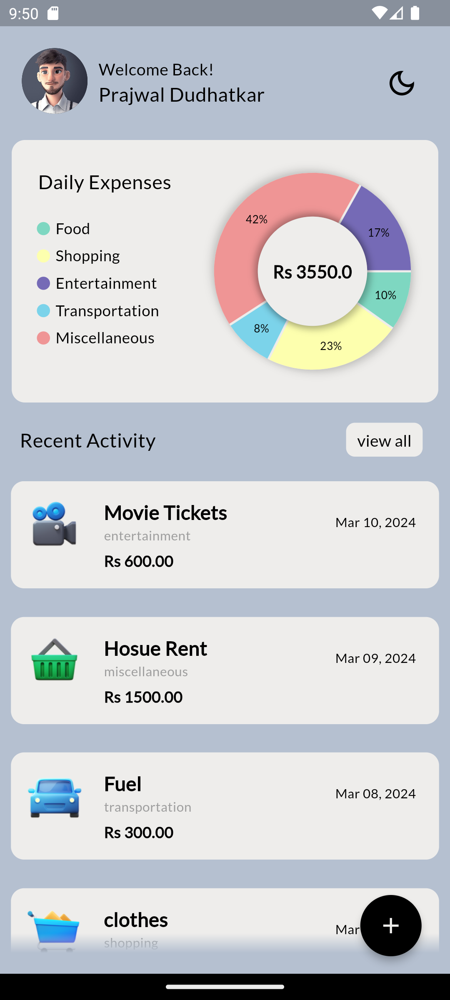
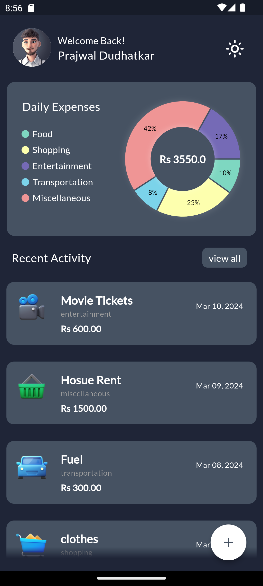
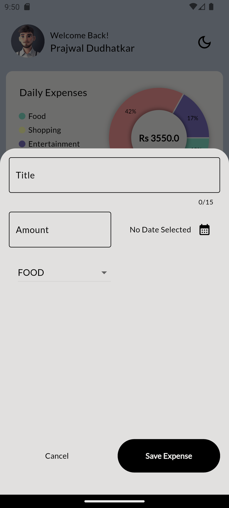
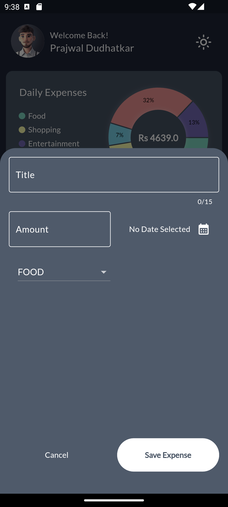
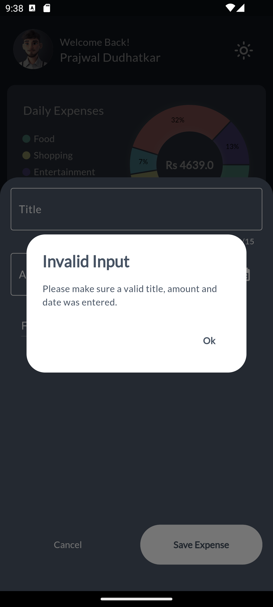
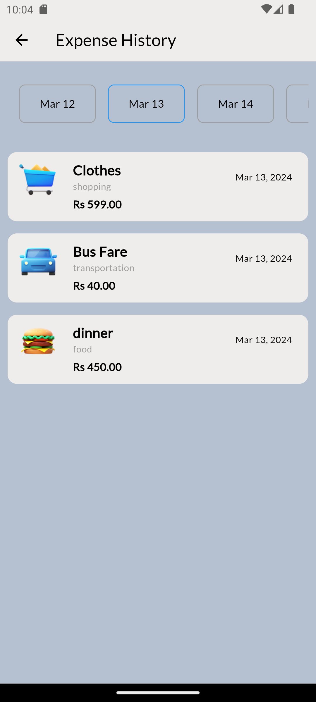

# Expense Tracker

The Expense Tracker App is a user friendly tool designed to help users track their expenses effortlessly. With its intuitive interface, users can easily add, delete, and store expenses, categorize them, and visualize them with a insightful chart.

## Features

- Add and delete expenses effortlessly.
- Organize expenses with customizable categories.
- Visualize spending patterns with clear chart representations.
- Seamlessly switch between dark and light themes for personalized viewing.
- Store and access historical expense records for reference using Shared Preferences.
- Track expenses on the go with multi-platform compatibility.
- Secure data storage using Shared Preferences to protect sensitive financial information.

# Output

